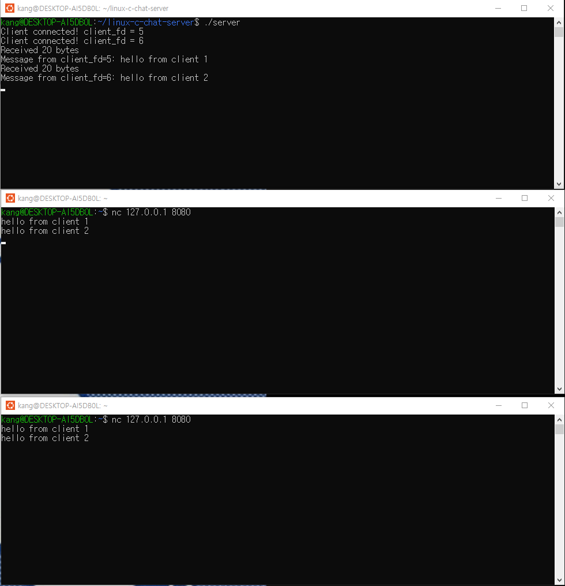

# Linux C Chat Server

A multi-client TCP chat server written in C on Linux.

This project implements a non-blocking TCP server using `epoll`.
Multiple clients can connect simultaneously and messages are broadcast
to all connected clients except the sender.

## Features

- TCP socket server
- Multiple client connections
- Non-blocking I/O
- `epoll`-based event handling
- Newline-based message framing
- Message broadcasting
- Client connection/disconnection handling
- Error and resource cleanup

## Build

```bash
gcc -Wall -Wextra server.c -o server
gcc -Wall -Wextra client.c -o client
```

## Run

Start the server:

```bash
./server
```

Connect clients from other terminals:

```bash
nc 127.0.0.1 8080
```

The server listens on TCP port `8080`.

## How It Works

1. The server creates a TCP listening socket on port `8080`.
2. The listening socket and client sockets operate in non-blocking mode.
3. `epoll` monitors multiple client connections efficiently.
4. Each client has its own message buffer.
5. TCP data is accumulated until a newline (`\n`) completes a message.
6. Complete messages are broadcast to all connected clients except the sender.
7. Disconnected or failed clients are removed and their resources are released.

## Technologies

- C
- Linux
- TCP/IP sockets
- epoll
- Non-blocking I/O
- Git / GitHub

## Project Structure

```text
linux-c-chat-server/
├── server.c
└── README.md
```

## Demo

The screenshot below shows two clients connected to the server and exchanging messages through the broadcast server.


